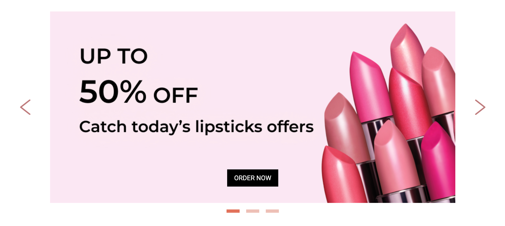

```typescript
import { Component } from '@angular/core';
import { AngularBannerSlider, Banner } from 'angular-banner-slider';

@Component({
  selector: 'lib-plugin-banner-slider',
  standalone: true,
  imports: [
    AngularBannerSlider,
  ],
  template: `
    <angular-banner-slider
      (pressedButton)="pressedButton($event)"
      [banners]="banners"></angular-banner-slider>
  `,
})
export class PluginBannerSliderComponent {
  banners: Banner[] = [
    { img: '/assets/plugins-assets/banners/1.png',
      seoText: 'Catch today’s lipsticks offers',
      button: { color: '#FFF', bgColor: '#000', text: 'ORDER NOW' } },
    { img: '/assets/plugins-assets/banners/2.png',
      seoText: '3 Step Beauty Ritual',
      button: { color: '#000', bgColor: '#FFF', text: 'SHOP NOW' } },
    { img: '/assets/plugins-assets/banners/3.png',
      seoText: 'Best offers this month’s',
      button: { color: '#FFF', bgColor: '#000', text: 'ORDER NOW' } },
  ];

  pressedButton(i: number) {
    alert(i);
  }
}
```
